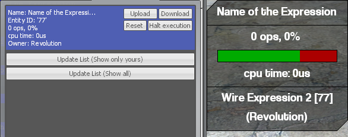
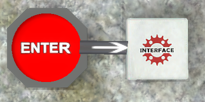
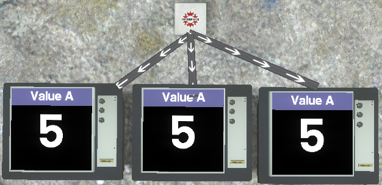
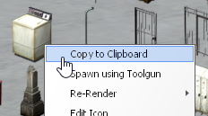
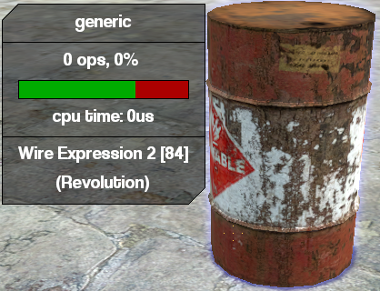

# Directives

## @name
This directive sets the name of the expression 2 chip. The name is viewed in two places, one when hovering your mouse over the expression and the other when looking inside the remote updater. You can   get the name of your expression in code by using `entity():getName()`.



```
@name Expression name
        
#prints "Expression name"
print(entity():getName())
```

## @inputs
This directive sets the expression's inputs. It is used to wire between your chip and other wire-compatible tools.



```
@inputs Button

#Check if Button has changed value since last execution
if(~Button) {
  print("Button is pressed or released")
}

#Check if Button is connected as an input or output
if(->Button) {
  print("Button is connected as an input or output")
}
```

## @outputs
This directive sets the expression's outputs. What differs input and output is that input takes in data from outputs, while output pushes data to other inputs.



```
@outputs Screen

Screen = 5
```

## @persist
This directive exists because of how Expression 2 variables work. When a variable is declared in the code, it is removed when the code is finished executing. To prevent this, we need to persist the
variable. Try to run the code below without changing the code. Next time, try uncommenting the first line
by removing the #.

```
#@persist Number
#interval() tells Expression 2 to run the code
#once every x milliseconds (1 second in this example)
interval(1000)

#first() is a function that returns true (1) if
#this is the first time the code is executed after upload.
#The second time and onwards, first() will not be true.
#Thus, Number = 5 will only be executed once.
if(first()) {
  Number = 5
}

print(Number)
```

## @trigger
This directive sets which inputs should trigger an execution.

```
#sets the expression to not execute from any inputs
@trigger none

#sets the expression to execute on all inputs (default)
@trigger all

#sets the expression to execute only on specified inputs
@inputs A B C D E
@trigger A B E
```

## @model
This directive sets what model the expression should be. The easiest way to get a model name is to simply open the spawnmenu > find the model you want the expression to be > right click > copy to clipboard





```
@model models/props_c17/oildrum001_explosive.mdl
```

## @autoupdate
This directive is useful if you have a contraption that you save as a duplicate. When an expression with the @autoupdate directive is loaded, it automatically checks for any newer version of the same
expression. Note that @autoupdate only works with saved expressions. Let's take an example.

The first thing you do is make an expression that looks like this, and *save it*

```
@autoupdate

if(first()) {
  print("I am old")
}
```

Then you open the code (not on the expression you placed!) and update the code with this, then save:

```
@autoupdate

if(first()) {
  print("I am new!")
}
```
Now, the expression you placed on the ground has the old code. The new code is saved in the SAME FILE as the one you placed uses. Take out the advanced duplicator, right click the expression on the ground to copy, then paste it somewhere else with left click. You never changed the contents of the expression on the ground, but the @autoupdate directive made the expression fetch the new version of the code.

## Good to know
There are some properties about directives that are good to know.
1. You can completely omit directives, it's not required to have them in your code.
2. You can have several directives of the same kind, with the exception of @name, @trigger and @model. It ispossible to have more than one @autoupdate, but that is pointless.

```
@inputs  A B C
@inputs  D E F
@inputs  G H I
@outputs J K L
@outputs M N O
@outputs P Q R
@persist S T U
@persist V W X
```

3. You can group variables together to define their type. Since you can define more than one
@inputs,
@outputs
and @persist, the two properties combined makes a clean look at the top of your code

```
@persist [A B C D]:string [E F G]:vector

@persist [A B C D E F G]:string
@persist [H I J K L M N]:vector
```

# It's QUIZ TIME
<!-- <lw-quizlet type="multiplechoice" question="Which of these will trigger an execution?"
alternatives="XA;OB;XC;OD;XE;"></lw-quizlet> -->


### Which of the inputs will trigger an execution?
```
@inputs A B C D E F G H
@trigger B D G H
```

::: details
The right answer is B

Remember that even though default behavior is that all inputs are triggered, with the @trigger directive only the set inputs makes the expression execute
:::
