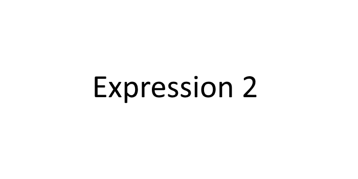

<script>
import Comp from "../components/Comp.vue"
</script>
<Comp />

# Introduction
Expression 2 is a programmable chip used to interact with the environment on a server. These are some of the things you can build with Expression 2. **This course is** linear, you are supposed to go from first page to last page in chronological order. *Even if you aren't new*, I do recommend that you skim through from the beginning. You never know, maybe you learn something new?

**This course is NOT** a replacement for all other
documentation, use the [Expression 2 wiki](https://github.com/wiremod/wire/wiki/Expression-2) as a supplement.

**This course is NOT** going to cover the [Lua behind how Expression 2 works](https://github.com/wiremod/wire)

## Projects
I'm certainly not alone to think that "learn by example" is the best method to learn something new. Below are the projects you'll be doing throughout the course.

## Need help?
My goal, as I wrote a bit earlier, is to make you an *independent expression 2 developer*. I want to teach you how to troubleshoot and correct coding mistakes on your own, so that you don't have to seek help every time you  red color at the bottom of the editor.

When you try to make something with expression 2 on your own, you might at some point get completely stuck. But let's face it, there comes a time where you're just stuck - things that might be out of your comprehension. It happens to everyone. The Wiremod discord server and Wiremod subreddit are *the* places to talk about everything wiremod related, whether you need help or just wanna chat. Those are linked in the side navigation to the left. There are lots of youtube videos out there, old and new, that can also help you out.
      
```
@name Sudoku./129q--<>?
@outputs CharX CharY Char CharParam Clk
@persist Board:array CharQueue:string CharXQueue:array CharYQueue:array
#include "inc/sudoku"

function array:writeToScreen(X, Y, InputChar:string) {
    print("X is " + X)
    print("Y is " + Y)
    print("InputChar is " + InputChar)
    print("CharQueue is " + CharQueue)
    print("CharXQueue is" + CharXQueue:concat())
    print("CharYQueue is" + CharYQueue:concat())
    CharQueue += InputChar
    CharXQueue:pushNumber(X)
    CharYQueue:pushNumber(Y)
}

if(first()) {
    runOnHTTP(1)
    runOnChat(1)
    
    if (!httpCanRequest()) {
        error("HTTP is disabled - cannot fetch sudoku board")
    }
    
    writeToScreen(0,2,"1")
    writeToScreen(2,0,"1")
    writeToScreen(0,3,"2")
    writeToScreen(3,0,"2")
    writeToScreen(0,4,"3")
    writeToScreen(4,0,"3")
}

elseif(clk("nextChar")) {
    if (CharQueue != "") {
        #Copy-by-value or copy-by-reference?
        Char = toByte(CharQueue[1])
        CharQueue = CharQueue:replaceRE("^%w", "")
    }
}

function place(X, Y, C:string) {
    writeToScreen(X, Y, C)    
}

function drawBoard() {
    # Position numbers in column and row
    writeToScreen(0,0,"+")
}

function parseInput(Input:string) {
    
}

if (chatClk(owner())) {
    hideChat(1)
    
    if (owner():lastSaid()[1] == "!") {
        parseInput(owner():lastSaid():sub(2))
    }
}

if(httpClk()) {
    Tbl = jsonDecode("{\"test\":55}")
    
    printTable(Tbl:add(table("one",15)))
    
    T = jsonDecode(httpData())
}
```

<!-- <lw-quizlet type="singlechoice" question="Are you ready to learn about Expression 2?"
  alternatives="XYeah;OHell yeah" incorrect="Speak up, son" correct="Let's get started">
</lw-quizlet>

<lw-quizlet type="multiplechoice" question="Where do you go to get help?"
  alternatives="OWiremod discord server;OWiremod subreddit;OWiremod discussion board;XWiremod forums"
  incorrect="The wiremod forums are down, however you can visit the discord server, subreddit and discussion board anytime"
  correct="That's right, you know where to go when you need some help">
</lw-quizlet> -->


<!-- <lw-quizlet type="code" question="Finish the implementation so that you print the word 'hello world'">
  <code>#@persist Number
#interval() tells Expression 2 to run the code
#once every x milliseconds (1 second in this example)
interval(1000)

#first() is a function that returns true (1) if
#this is the first time the code is executed after upload.
#The second time and onwards, first() will not be true.
#Thus, Number = 5 will only be executed once.
if(first()) {
  Number = 5
}

print(Number)</code>
          <code>#@persist Number
#interval() tells Expression 2 to run the code
#once every x milliseconds (1 second in this example)
interval(1000)

print("Hello world")

print(Number)</code>
        </lw-quizlet> -->
      