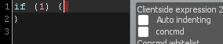

title: Expression 2 - the tool
---
# Exploring the tool

## In the spawnmenu
Open up the spawnmenu with Q, and have a look at the Wire tab. Under **Chips, Gates** you'll find Expression 2. After selecting the tool, close the spawnmenu and right click to open the editor. Optionally, you can click "Open Editor" from the spawn menu.

You can change size and model of the chip, and open and create files and folders

The sizes and models of the Expression 2 chip

You can create, open, copy, rename and delete files. You can create and rename folders.

Right clicking a folder vs. right clicking a file

## Editor overview

Shows any errors in the code. Click to jump to the error

Update the contents of the file explorer

Expand or retract file explorer

Save currently open file

Open new tab

Close current tab

Refresh current file - this button is only ever used if you work on the Expression 2 files outside of Garry's mod

Browse the sound files from Garry's Mod or mounted games

Browse all loaded Expression 2 functions

Save current file as

Save current file and exit the editor

Open editor settings

Show credits

Close editor

The Expression 2 code editor

## Editor settings
Hit that  button and edit along. We're going to go over a couple of settings so that the programming experience will be better. We'll first take a look at the settings in the editor tab.

### Auto completion

Auto completion
ON

More info
ON

Auto completion control style
DEFAULT

Highlight word after AC use
OFF

Auto completion both helps you in correctly typing functions, and discovering new functions.

### Other options

New tab on open
ON

Save tabs on close
ON

Open old tabs on load
ON

Show caret position
ON

Highlight copies of selected word
ON

Enable clicking outside editor
OFF

You'll want to disable clicking outside the editor because of this happening when you resize the
window

## Expression 2 settings
Now you need to navigate to the second tab of the settings page.

Auto indentation
ON

Concmd
OFF

Concmd whitelist
LEAVE IT BLANK

Expression 2 block comment style
DOESN'T WORK

Highlight copies of selected word
ON

Ops/cpu usage sync
ON

Auto indenting automatically inserts the correct indentation (space to the left) when you press
enter

## Remote updater settings
In this menu, you can manage your expressions remotely. The feature is very useful if, for example, your expression is far away from you or deep within a contraption and you want to edit it. The menu benefits server admins too, as not all expressions are coded with good intents. Some people who code expressions do everything in their might to be as annoying as possible, playing loud sounds everywhere and trying to crash the server.

Sometimes you can find evil expressions in the remote updater list